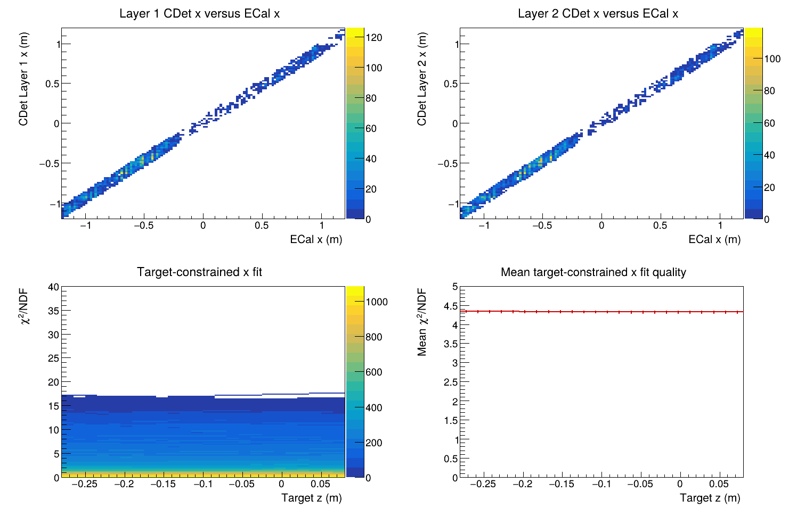
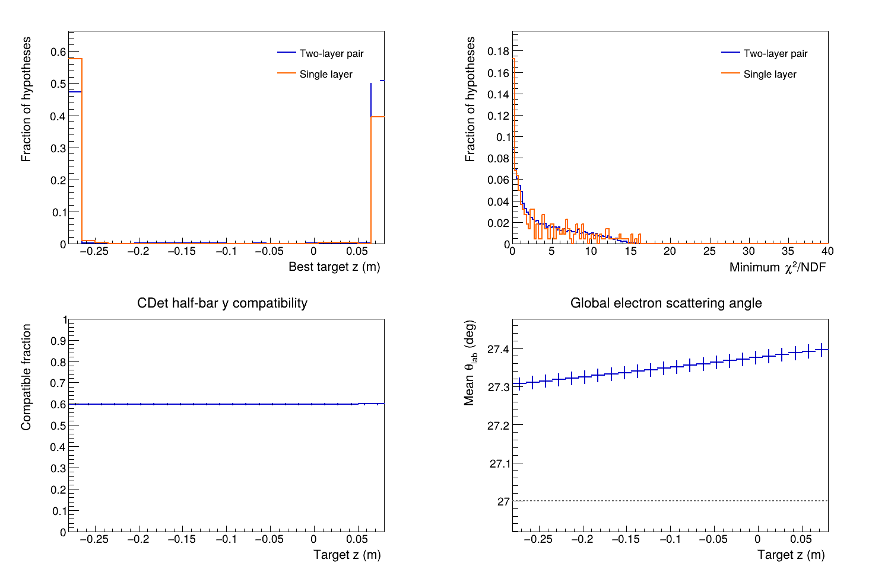
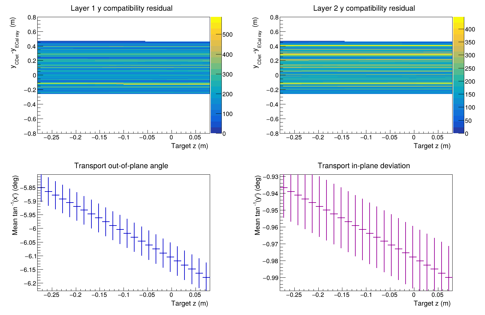
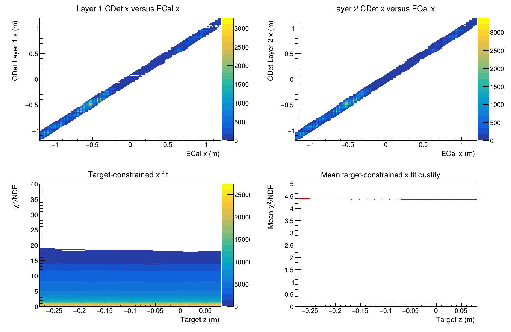
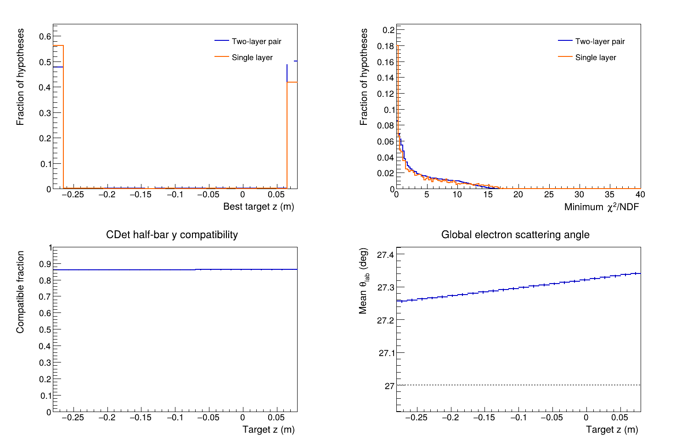
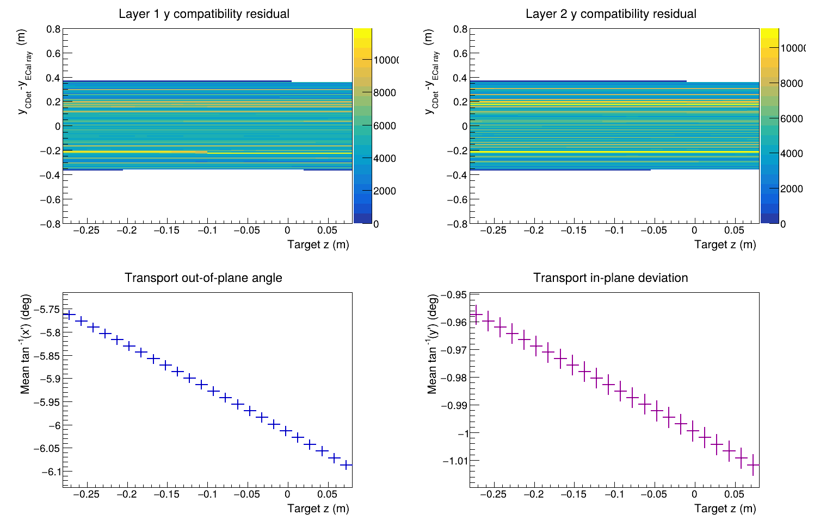
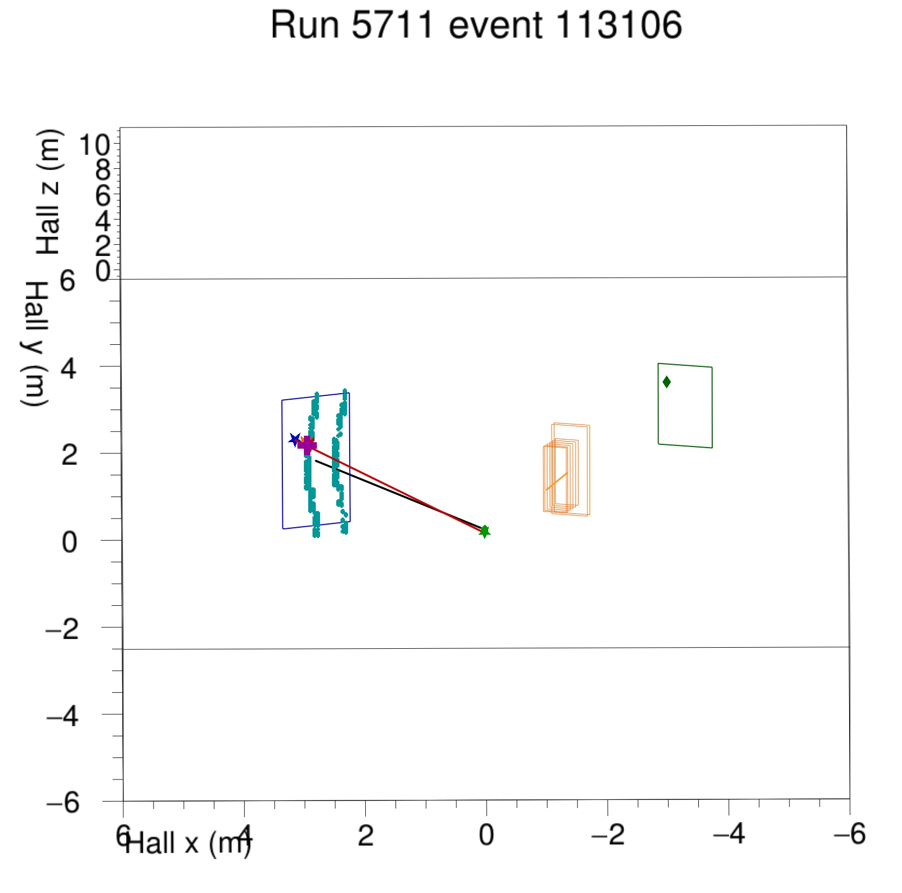
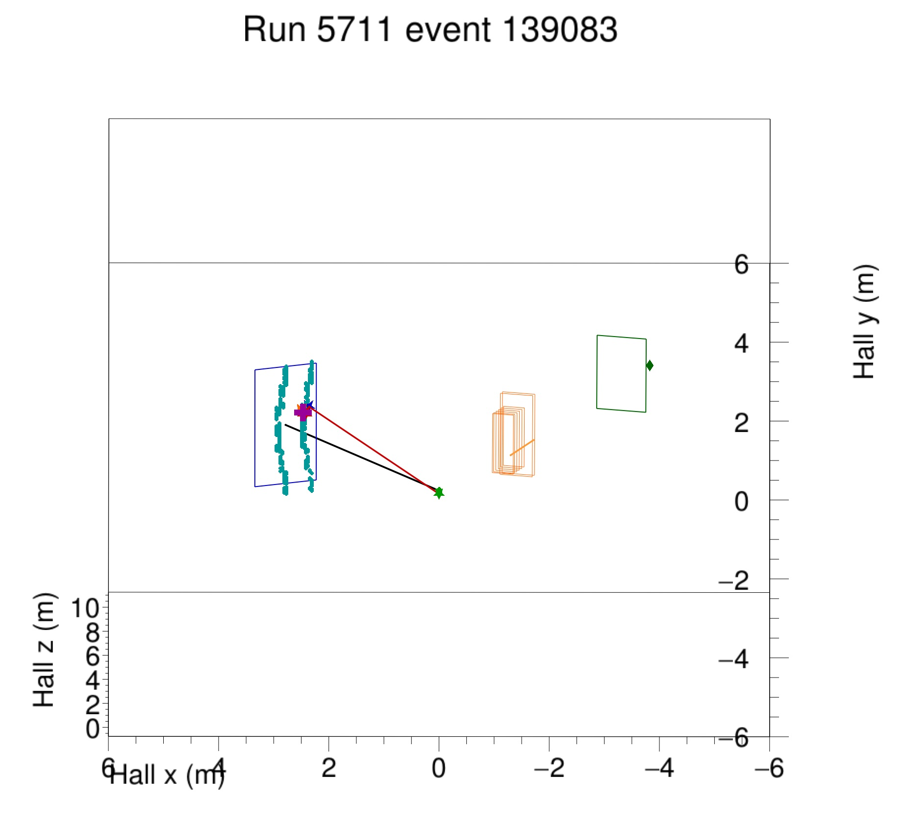
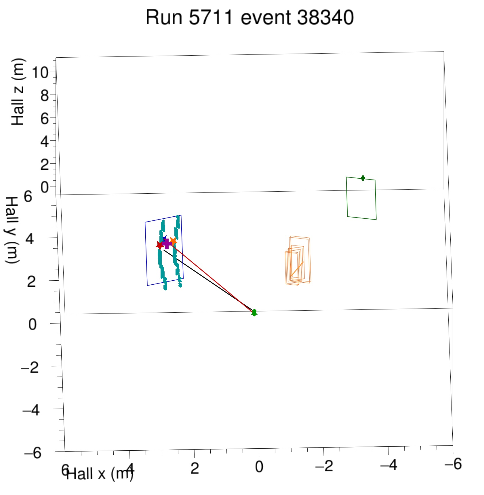

# Step 5: integrating CDet candidates with the GEP ROI module

Status: Step 5A and the non-operative Step 5B diagnostic slice are
implemented. CDet-derived hypotheses are exported for study, but they do not
yet alter any GEM constraint.

This document tracks Step 5 of
`CDet_SBS_OFFLINE_ROI_IMPLEMENTATION.md`: connect the validated, public
`SBSCDet` candidate interface to `SBSGEPRegionOfInterestModule` without
duplicating CDet calibration or prematurely discarding alternate CDet
hypotheses.

## Physics and reconstruction motivation

CDet was conceived primarily to improve the electron out-of-plane angular
resolution, thereby helping identify the very rare elastic events in the GEP
data. That remains the central physics motivation for incorporating CDet into
the global ROI calculation.

The implementation may also provide an important analysis-efficiency benefit.
Hydrogen running can produce such high GEM occupancy that the unconstrained
track search encounters an enormous number of possible hit combinations. A
useful CDet-informed electron hypothesis can sharpen the predicted proton ROI
before GEM pattern recognition, potentially reducing the combinatorial search
while preserving the existing ECal/HCal-only fallback.

This possible computational benefit must be measured rather than assumed. A
CDet constraint that is too tight could make reconstruction faster by losing
valid tracks, which would not be acceptable. Step 5 validation must therefore
measure both reconstruction cost and physics efficiency.

## Scope of this first checkpoint

Before changing the ROI implementation, this checkpoint establishes:

- when the ROI module runs in the analyzer event sequence;
- which detector information it currently consumes;
- what it currently means by a region of interest;
- which GEM constraints it creates;
- when calibrated CDet candidates become available;
- the safe software boundary for adding CDet;
- the physics decisions that must be explicit before implementation.

The source files reviewed for this description are:

- `SBS-offline/SBSGEPRegionOfInterestModule.h` and `.cxx`;
- `SBS-offline/SBSGEPEArm.cxx`;
- `SBS-offline/SBSEArm.cxx`;
- `SBS-offline/SBSGEMSpectrometerTracker.cxx`;
- `SBS-offline/SBSCDet.h` and `.cxx`;
- `SBS-replay/replay/replay_gep.C`;
- `SBS-replay/DB/db_FTROI.dat`.

## What the existing ROI module is

`SBSGEPRegionOfInterestModule` is a Podd `InterStageModule`. It is not a
detector and it does not itself perform GEM tracking. Its present job is to
run between analyzer stages, use already reconstructed calorimeter
information to predict a family of elastic proton trajectories, and install
front/back constraint points in the two GEM trackers before constrained
tracking begins.

`replay_gep.C` constructs it as:

```cpp
new SBSGEPRegionOfInterestModule(
    "FTROI", "GEP region of interest calculation",
    THaAnalyzer::kCoarseRecon);
```

It is registered only when `dogems != 0`. The `kCoarseRecon` stage means its
`Process()` method runs after apparatus coarse reconstruction and before the
later tracking/reconstruction work that consumes the installed constraints.

In this code, "ROI" currently means **a set of allowed constraint rays for
GEM tracking**, not an event display region, a rectangular detector cut, or a
final physics-event decision.

## Event sequence relevant to CDet

The relevant event flow is:

```text
detector Decode
    |
apparatus CoarseReconstruct
    |
    +-- ECal CoarseProcess and cluster reconstruction
    |
    +-- CDet CoarseProcess
    |       build complete pulse triplets
    |
    +-- SBSGEPEArm::CoarseReconstruct
            call CDet::ApplyECalTimingCalibration(...)
            apply timing and position corrections
            build pair_candidate.*, pair.*, and single_candidate.*
            create the E-arm pseudo-track from the best ECal cluster
    |
FTROI inter-stage Process
    |       read already reconstructed detector information
    |       clear and install GEM constraint points
    |
fine/constrained GEM tracking and later reconstruction
```

This ordering is essential. CDet candidate construction cannot be moved into
`SBSGEPRegionOfInterestModule`, because the calibration and candidate
decisions belong to `SBSCDet` and are already complete before the ROI module
runs. Conversely, the ROI module is the first natural global location that
can combine those candidates with other detectors.

## Detector discovery and prerequisites

On every event, `SBSGEPRegionOfInterestModule::Process()` scans `gHaApps` and
finds objects using names loaded from `db_FTROI.dat` (or constructor defaults):

| Role | Default apparatus/detector | Required class |
|---|---|---|
| Electron arm | `earm` | `SBSGEPEArm` |
| Electron calorimeter | `earm.ecal` | `SBSECal` |
| Hadron arm | `sbs` | `SBSEArm` |
| Front GEM tracker | `sbs.gemFT` | `SBSGEMSpectrometerTracker` |
| Polarimeter/back GEM tracker | `sbs.gemFPP` | `SBSGEMPolarimeterTracker` |
| Hadron calorimeter | `sbs.hcal` | `SBSHCal` |

The current module returns with invalid data if any of these objects is
missing, or if the hadron arm is not in GEP tracking mode. It clears the
existing front- and back-tracker constraints before imposing event-specific
ones.

It then requires:

```text
at least one HCal cluster
AND at least one E-arm track.
```

The E-arm "track" used here is presently the pseudo-track constructed from
the best ECal cluster, not an independently fitted charged-particle track.
Therefore the current ROI seed is calorimeter driven.

## How the current ROI is calculated

### 1. Establish the measured calorimeter points

The module takes the best HCal cluster and expresses its position in the SBS
focal-plane coordinate system. It takes the first E-arm pseudo-track and uses
its ECal position and energy to build the global ECal cluster position.

The ECal position is also passed to the front GEM tracker through
`SetECALpos()`, where it may be used by the tracker's separate elastic
constraint logic.

### 2. Calculate a central elastic solution

For a nominal target vertex `z0targ`, the ECal direction defines the electron
scattering angles. With the run beam energy and elastic electron-proton
kinematics, the module calculates:

- expected scattered-electron energy;
- expected proton momentum;
- expected proton polar and azimuthal angles.

The predicted proton ray is transformed into SBS transport coordinates and
transported through the forward optics matrix to obtain a central focal-plane
position and direction:

```text
xfp0, yfp0, xpfp0, ypfp0.
```

These values are exported as diagnostic variables; they are not a reconstructed
GEM track.

### 3. Scan the extended target

`db_FTROI.dat` currently defines 24 target-z bins. For the later five-pass
period the nominal range is `-0.28 < z < 0.08 m`. For every assumed vertex,
the module repeats the elastic-kinematics and forward-optics calculation.

This produces a family of allowed proton rays rather than one point-target
prediction. The target scan is the present source of multiple front/back
constraint-point pairs.

### 4. Install GEM constraints

For the front tracker (`gemFT`):

- the front constraint is placed at its local `z = 0` plane;
- the back constraint is placed 5 cm beyond its last GEM layer;
- each point follows the predicted proton focal-plane ray, plus configured
  constraint offsets.

For the polarimeter/back tracker (`gemFPP`):

- the front constraint is placed at the analyzer midpoint;
- the back constraint is anchored to the measured HCal cluster position.

When a tracker is in multi-track mode, all vertex-bin hypotheses are added.
Otherwise, only the central hypothesis is installed. The tracker later uses
these points and its independently configured constraint widths to restrict
track finding.

## What the ROI module currently exports

The `FTROI.*` variables are diagnostics describing the calorimeter seed and
central elastic prediction:

- global ECal x, y, and z;
- ECal energy;
- predicted electron and proton angles;
- predicted scattered-electron energy and proton momentum;
- central predicted focal-plane position and slopes;
- the inherited `InterStageModule` data-valid state.

It presently exports no CDet identity, candidate count, candidate score,
candidate-to-constraint association, or ROI acceptance classification.

## CDet information available at the Step 5 boundary

By the time `FTROI.Process()` begins, `SBSCDet` provides four distinct levels
of information through public read-only accessors:

| Interface | Meaning |
|---|---|
| `GetPulseCandidate()` | Complete calibrated pulse with detector coordinates, ECal projection/residuals, and quality flags |
| `GetLayerPairCandidate()` | Every ranked two-layer hypothesis passing detector-local gates and the configured ECal trajectory-time ellipse; hypotheses may share pulses |
| `GetLayerPair()` | Final detector-local one-to-one greedy pairs retained for backward compatibility |
| `GetSingleLayerCandidate()` | Accepted candidates in exclusive one-layer events |

`GetROICandidateStatus()` summarizes whether the event has pair hypotheses,
Layer-1-only candidates, Layer-2-only candidates, or no accepted CDet
candidate.

For global ROI work, `GetLayerPairCandidate()` is the important two-layer
interface. The final `GetLayerPair()` collection has already discarded
alternatives through a CDet-local one-to-one choice. The purpose of the global
ROI is precisely to allow ECal, CDet, GEM, and HCal information to resolve
such ambiguities. The selected-pair collection should remain available for
comparison and backward compatibility, but should not silently replace the
candidate collection at this boundary.

## Safe software integration point

The smallest structurally correct Step 5 change is inside
`SBSGEPRegionOfInterestModule`, not inside `SBSCDet::FineProcess()`:

1. find `earm.cdet` alongside `earm.ecal` during detector discovery;
2. verify that CDet timing calibration completed for the event (there is not
   yet a public `GetTimingStatus()` accessor, so Step 5A must either add a
   read-only status accessor or define an equally explicit validity test);
3. read immutable pulse, pair-candidate, and single-layer snapshots through
   the public `SBSCDet` accessors;
4. translate accepted CDet hypotheses into explicit global-ROI hypotheses;
5. preserve the association between every ROI hypothesis and its source CDet
   candidate(s);
6. install or publish the resulting constraints without changing the
   detector-local collections.

This preserves the ownership boundary established in Steps 1-4: `SBSCDet`
calibrates and classifies CDet information; the ROI module combines detector
information.

## Physics decisions established for Step 5

The current ROI predicts the **proton** trajectory from ECal elastic
kinematics and uses HCal to constrain the back tracker. CDet measures the
electron arm. The following decisions now define how CDet enters that logic.

### The existing fallback is unconditional

If an event has no accepted CDet candidate, it must retain the current
ECal/HCal-only ROI calculation. Missing CDet information is not grounds for
rejecting an otherwise processable event. This is both a physics requirement
and the principal backward-compatibility rule for Step 5.

### ECal and CDet share one rigid detector frame

CDet and ECal are physically housed in the same rigid detector frame, and the
CDet database positions have been characterized in the ECal coordinate
system. CDet points must therefore use the same detector-to-global rotation
and translation used for ECal. Step 5 must not introduce an independent CDet
alignment frame or a second set of arm axes.

Concretely, the ROI code should first represent all ECal and CDet measurements
as points in their shared electron-arm frame, and then apply the existing
electron-arm-to-global transformation consistently to every point. A useful
validation invariant is that projecting the transformed CDet points back into
the electron-arm frame reproduces the stored CDet coordinates.

### All available three-dimensional detector points contribute

For a two-layer CDet hypothesis, the electron-trajectory calculation should
use all three measured points:

```text
(x, y, z)_ECal
(x, y, z)_CDet Layer 1
(x, y, z)_CDet Layer 2
```

For an exclusive single-layer hypothesis, it should use the ECal point and
the one available CDet point:

```text
(x, y, z)_ECal
(x, y, z)_CDet Layer 1 or Layer 2.
```

The pulse indices stored in a `LayerPair` identify the two
`PulseCandidate` snapshots containing the required coordinates. A
`SingleLayerCandidate` similarly identifies its source pulse. The ROI module
should obtain coordinates through those source identities rather than
reconstructing pixel geometry independently.

The two-layer case is an overconstrained straight-line measurement in x and
can provide both a best electron ray and a fit-consistency diagnostic. The
single-layer case supplies only two detector points, so it defines an x-z ray
but has less redundancy. Its uncertainty should follow from the ECal and CDet
position resolutions rather than from an arbitrary extra cut.

### CDet y is a coarse half-bar constraint, not a precision measurement

At present, CDet supplies essentially no useful independent continuous-y
measurement. The stored y coordinate identifies the relevant half-bar, but it
must not be assigned the same precision as the CDet x coordinate.

For tracking, each CDet point therefore carries:

```text
y_CDet = nominal half-bar center
uncertainty interval = y_CDet +/- (half-bar length)/2.
```

This interval expresses the actual detector information: the particle passed
somewhere along that half-bar. The half-bar length should come from the
detector geometry applicable to the source pulse rather than from a new
independent hard-coded tracking constant.

The operational target-associated diagnostic uses the half-width itself,
`delta_y,CDet = (half-bar length)/2 = 0.255 m`, as a compatibility interval.
It does not convert that interval to a Gaussian RMS and does not use CDet y to
fit the target-associated electron-ray slope. The earlier free detector-only
y fit is retained only as an explicitly labelled diagnostic demonstrating why
that formulation was rejected.

Consequently, the initial electron-ray model is deliberately asymmetric:

- x-z fitting uses the meaningful ECal and CDet layer positions and their
  measured resolutions;
- for each target-z hypothesis, the y-z ray is defined by that target point
  and ECal y; each available CDet half-bar is only tested for intersection
  with its broad y interval.

The output reports the CDet y residual and interval compatibility separately
for each layer and target-z bin. A future independent CDet y
reconstruction can replace this uncertainty model without changing the
candidate identities or the Step 5 interface.

### Initial CDet x uncertainty from Run 5710

The initial effective CDet x uncertainty is taken from the standard deviation
of the ECal-trajectory residual in the Run 5710 candidate comparison (row 2,
column 3 of `CDet_Run5710_CandidateBranchComparison.pdf`). The underlying
histogram contains:

```text
entries = 365,256
mean    = -0.00536588 m
sigma   =  0.0179730 m = 1.79730 cm.
```

The independently reconstructed and analyzer-native histograms have identical
statistics. Step 5 will therefore begin with:

```text
sigma_x,CDet = 0.017973 m
```

for each CDet layer point in the electron-ray fit. This is intentionally a
conservative **effective** per-point uncertainty, not a claim that the
intrinsic position resolution of one layer is 1.80 cm.

The measured residual is

```text
(x_L2 - x_L1) - x_ECal * (z_L2 - z_L1) / z_ECal,
```

so its variance contains both CDet layer uncertainties, the smaller
ECal-projection contribution, and any residual alignment, selection, or
non-Gaussian effects. If the two CDet layers had equal independent resolution
and every other contribution were negligible, the corresponding per-layer
value would instead be `1.797/sqrt(2) = 1.27 cm`. Using the full measured
1.80 cm for each point avoids overstating CDet precision in the initial ROI
fit. Pull distributions from Step 5B will show whether this conservative value
should later be refined.

### Provisional ECal x and y uncertainties

The ECal group reports position uncertainties of 6 mm in both transverse
coordinates. These values have not been independently established by the
present CDet study, and there is some concern that they may be optimistic.
Nevertheless, they are the appropriate collaboration inputs to use unless and
until data provide evidence for different values. The initial electron-ray fit
will therefore use:

```text
sigma_x,ECal = 0.006 m
sigma_y,ECal = 0.006 m.
```

These must be configurable inputs rather than immutable hard-coded constants.
With `sigma_x,CDet = 0.017973 m`, ECal will receive substantially greater
weight than either CDet layer in the x-z fit. In y, the 6 mm ECal uncertainty
is much smaller than the CDet half-bar uncertainty, so ECal should dominate
the y-z information as intended.

Step 5B exports fit chi-square and leverage-corrected standardized residuals
for the free detector-only fits. Ordinary fitted residuals divided only by the
input measurement sigma must not be interpreted as unit-width pulls because
the fitted measurements have nonzero leverage. The target-z-constrained x fit
exports its chi-square and NDF for every candidate and vertex bin. These
quantities should be examined versus run, detector position, ECal energy, and
candidate class. Until that validation is complete, the 6 mm values are
working assumptions and must not be presented as results of the CDet analysis.

### CDet supplements the target-z scan

A CDet hypothesis should initially supplement, not replace, the current
extended-target scan. The scan remains important because the interaction
vertex is not known a priori.

There is a genuine coupling that must be studied. The present CDet
trajectory-time ellipse is formed relative to an ECal-to-nominal-target ray,
effectively using `(x,y,z)_target = (0,0,0)` during candidate selection. The
true event vertex is distributed through the extended target. The large
target-to-detector distance should make this a modest effect, but that must be
demonstrated rather than assumed.

The initial Run 5711 replay resolved the comparison between two formulations:

1. fit the detector-only electron ray from the ECal and available CDet
   points, then compare its target intersection with each target-z hypothesis;
2. for every target-z bin, include the assumed target point together with the
   ECal/CDet measurements in a resolution-weighted constrained line fit and
   retain the fit quality.

The detector-only extrapolation was far too unstable at the target, especially
in y. The operational diagnostic is therefore formulation 2 in x: for every
target-z bin, fit the best x slope constrained to pass through `x=0` at that
vertex and retain its chi-square. In y, do not perform a CDet line fit; use the
target-to-ECal line and test only whether it intersects each CDet half-bar
interval.

### Resulting global interpretation

For every accepted CDet hypothesis, the intended global calculation is now:

1. build an electron-ray hypothesis from ECal and all available CDet layer
   points in their common frame;
2. combine that ray with the existing target-z scan;
3. recalculate the elastic proton kinematics for the resulting electron/vertex
   hypothesis;
4. create the corresponding proton-arm GEM constraint family;
5. retain multiple CDet-derived families when CDet is ambiguous, allowing the
   later global tracking information to resolve them.

If no CDet hypothesis exists, execute the present ECal/HCal-only calculation
unchanged.

## Physics and representation questions still open

The decisions above settle the basic geometry and fallback policy. The
following still require explicit choices or measurement:

- validation of the provisional 6 mm ECal x and y uncertainties using fitted
  residuals and pulls;
- the exact statistic used to rank electron-ray/target-z hypotheses;
- how much the current nominal-origin pair ellipse changes acceptance across
  the target length;
- whether single-layer hypotheses require broader downstream GEM constraints
  after normal uncertainty propagation;
- how duplicate or nearly identical constraint families are merged or capped;
- which source indices, fit residuals, fit quality, vertex-bin identity, and
  CDet scores must be exported for auditability.

These are physics-policy decisions, not merely software plumbing. They should
be resolved in this document before modifying the tracker or other code owned
outside `SBSCDet` and `SBSGEPRegionOfInterestModule`.

## Proposed incremental implementation sequence

### Step 5A: read-only CDet discovery and diagnostics

- Add the configured CDet detector name to the ROI database interface.
- Locate `SBSCDet` and read its status and candidate counts after coarse
  reconstruction.
- Export diagnostic counts and source classifications only.
- Do not change any GEM constraint.

This proves stage ordering and object access with essentially zero physics
risk.

Implemented in `SBSGEPRegionOfInterestModule`:

- `earm.cdet` is discovered using the configurable `FTROI.cdet_name`;
- `SBSCDet` timing status and detector-local ROI status are read through
  public, read-only accessors;
- pulse, pre-greedy pair-candidate, and exclusive single-layer counts are
  exported under `FTROI.cdet.*`;
- absence of CDet is non-fatal and leaves the established ROI path unchanged.

### Step 5B: construct auditable ROI hypotheses without applying them

- Build internal ROI-hypothesis records from CDet pair candidates and
  exclusive single-layer candidates.
- Transform the ECal and source-pulse CDet points through their common rigid
  electron-arm frame and form the two- or three-point electron-ray fit.
- Associate each electron-ray hypothesis with the existing target-z scan.
- Store source candidate/pulse indices, vertex-bin identity, all geometry
  inputs, fit residuals, and fit quality.
- Export enough information to compare the predicted constraints against the
  existing ECal/HCal-only constraints in replayed events.
- Still do not change GEM tracking.

The initial non-operative Step 5B slice is also implemented. For every
pre-greedy pair candidate and every exclusive single-layer candidate it:

- retrieves the source pulse coordinates by their event-local identities;
- retains the free detector-only fits as diagnostics, with leverage-corrected
  standardized residuals rather than naive residual/sigma pulls;
- for every existing target-z bin, fits the best x slope constrained through
  `(x=0,z=z_vertex)` and exports its chi-square and NDF;
- defines y from the target-to-ECal line and tests each available CDet
  half-bar only for interval compatibility;
- transforms each target-constrained direction from the shared ECal/CDet
  frame into the global Hall frame using the existing E-arm axes;
- exports source type, source index, pulse indices, source score, number of
  fitted points, intercepts, slopes, chi-squares, NDF, global angles, and the
  fitted intercept at the nominal target z;
- projects each fitted ray through every bin of the existing target-z scan
  and exports a flattened, source-indexed association table.

The source-type encoding is `1 = pair candidate`, `2 = Layer-1-only`, and
`3 = Layer-2-only`. A two-point single-layer fit has zero fit NDF by
construction; its value is in the propagated ray and subsequent global
comparison, not an internal chi-square test.

No Step 5B value is passed to either tracker. The calls that install front and
back GEM constraints still consume only the original ECal/HCal calculation.

### Step 5C: optional application to GEM constraints

- Add a database switch, defaulting off, that allows CDet-derived hypotheses
  to affect tracker constraints.
- Retain the established ECal/HCal-only path as an explicit fallback and
  control sample.
- Apply multiple constraint families rather than forcing an early unique CDet
  choice.

### Step 5D: validation

- Verify no behavior change with the new switch disabled.
- Replay the established Run 5710, Run 5711, and Run 6077 samples.
- Audit candidate identity through the ROI hypothesis and resulting GEM
  constraint.
- Compare tracking efficiency, multiplicity, accidental rate, and elastic
  residuals against the unchanged baseline.
- Compare event-processing time, the number of GEM track-search combinations,
  and the frequency of combination-limit skips with and without CDet-informed
  constraints. Any speed improvement must be evaluated together with elastic
  efficiency and bias.

### Farm submission for CDet plus GEM/FTROI validation

The established `submit-cdet-jobs.sh` path is intentionally the fast,
CDet-only replay. It ultimately invokes `replay_CDet.C`, which does not
instantiate the GEM trackers or the `FTROI` inter-stage module. Passing or
defaulting a `dogems` argument in that macro does not enable GEM tracking.

Use the parallel launcher below for Step 5 validation:

```bash
./submit-cdet-gem-jobs.sh RUN NEVENTS FIRST_SEGMENT LAST_SEGMENT RUN_ON_IFARM
```

For example, after selecting the desired `OUT_DIR`, the Run 5711 and Run 6077
submissions are:

```bash
./submit-cdet-gem-jobs.sh 5711 100000 0 5 0
./submit-cdet-gem-jobs.sh 6077 100000 0 5 0
```

As in the legacy launcher, `NEVENTS` applies independently to every selected
segment job. Thus `100000 0 5` requests six jobs per run, each processing up
to 100,000 physics events beginning in its assigned segment; it is not a
single 100,000-event job spanning segments 0--5.

This launcher preserves the five-argument interface of
`submit-cdet-jobs.sh`, but selects `run-cdet-gem-replay.sh`. The latter invokes
`replay_gep.C` and explicitly calls `replay_gep(..., dogems=1, ...)`, thereby
instantiating `gemFT`, `gemFPP`, and `FTROI`. Output files consequently use the
`gep5_replayed_...root` naming convention rather than the CDet-only
`cdet_...root` convention.

### Initial Run 5711 replay observation

During the first interactive Run 5711 Step 5 diagnostic replay, the analyzer
processed only about three events per second with GEM tracking enabled. At
least one high-occupancy event produced:

```text
Warning in [SBSGEMTrackerBase::find_tracks]: total potential hit combinations
= 6.60989e+24, exceeds user maximum of 1e+24, skipping tracking...
```

This event was not merely slow: GEM tracking was skipped because the
combinatorial search exceeded its configured safety limit. The observation
does not yet demonstrate that CDet constraints will recover such events, but
it establishes a concrete second question for Step 5C: can CDet-informed ROI
constraints reduce the search space enough to make previously intractable
events reconstructable, in addition to improving the intended out-of-plane
angular resolution?

The diagnostic CDet hypotheses are constructed before the later GEM search,
so these branches should remain available even for events whose GEM tracking
is skipped. Such events are therefore a particularly useful validation sample.

### First 10,000-event Run 5711 validation

The completed validation file contained exactly 10,000 events. CDet was found
in every event and timing calibration was applied in 9,993; the remaining
seven had missing ECal timing input. The new bookkeeping passed all checked
invariants:

| Quantity | Result |
|---|---:|
| Events with at least one CDet ROI hypothesis | 2,673 |
| Pair-status events | 2,555 |
| Layer-1-only events | 89 |
| Layer-2-only events | 29 |
| Pre-greedy pair hypotheses | 13,747 |
| Exclusive single-layer hypotheses | 220 |
| Invalid source or pulse indices | 0 |
| Events with incorrect target-bin multiplicity | 0 |

Every hypothesis had exactly 24 target-z associations. Only ten events in the
entire sample contained a reconstructed GEM track, and 2,671 of the 2,673
events with CDet hypotheses had no GEM track. This makes the possible
reconstruction-efficiency benefit quantitatively important to investigate.

The free detector-only pair fits exposed the limitation anticipated in the
design discussion:

| Free-ray extrapolation at nominal target z | Mean | RMS |
|---|---:|---:|
| x | 0.0033 m | 0.701 m |
| y | 1.816 m | 2.773 m |

The result persisted for greedy-selected pairs. It demonstrates that the free
detector-only ray must not be used directly as a target constraint. It also
shows why a small ECal y uncertainty does not rescue the free y slope: the
slope remains weakly determined over the relatively short ECal-to-CDet lever
arm and becomes unstable when extrapolated back to the target.

These observations motivated the revised per-vertex diagnostics described
above: target-constrained x chi-square and half-bar-only y compatibility.

### Revised 10,000-event Run 5711 validation

The second 10,000-event replay exercised the revised target-z-constrained
diagnostics. Candidate production was unchanged, as required: 2,673 events
contained at least one CDet hypothesis, comprising 13,747 two-layer pair
hypotheses and 220 exclusive single-layer hypotheses. The following structural
checks passed:

| Check | Result |
|---|---:|
| Events with calibrated CDet timing | 9,993 / 10,000 |
| Hypotheses with exactly 24 target-z associations | all |
| Two-layer associations with x NDF = 2 | 329,928 |
| Single-layer associations with x NDF = 1 | 5,280 |
| Pair associations with a missing CDet y layer | 0 |
| Single-layer associations with exactly one missing CDet y layer | 5,280 |
| Associations passing half-bar y compatibility | 200,918 / 335,208 |

The constrained x-fit chi-square, constrained electron direction, per-layer y
residuals, and y compatibility are therefore populated consistently. Passing
the y check in about 60% of all hypothesis/target-z associations is not an
event efficiency: each event may contain several hypotheses and every
hypothesis appears once for each of 24 target-z bins.

The same replay quantifies the potential reconstruction-efficiency motivation:

| Run 5711 outcome in the unfiltered 10,000-event sample | Events |
|---|---:|
| At least one GEM FT track | 10 (0.10%) |
| At least one CDet electron-ray hypothesis | 2,673 (26.73%) |
| Both a GEM FT track and a CDet hypothesis | 2 |
| CDet hypothesis but no GEM FT track | 2,671 |
| GEM FT track but no CDet hypothesis | 8 |
| Neither | 7,319 |

These fractions are not elastic-event efficiencies because the denominator is
all replayed events. They do establish that CDet supplies electron-arm
direction information in a large sample for which the existing high-occupancy
hadron-arm GEM search finds no track. Step 5C must determine whether using that
information to restrict the GEM search recovers tracks without biasing elastic
acceptance or creating excessive duplicate constraints.

The CDet/ECal/target-z quantities can be viewed without any GEM information by
running:

```text
root [0] .L Plot_CDet_FTROI_TargetZDiagnostics.C+
root [1] Plot_CDet_FTROI_TargetZDiagnostics(
             "/path/to/gep5_replayed_5711_stream0_2_seg0_5_firstevent1_nevent10000.root",
             "CDet_run5711_FTROI_target_z",
             27.0);
```

The resulting multipage PDF shows ECal x versus the associated CDet-layer x,
the target-constrained x chi-square over the established target-z scan, the
minimum-chi-square target-z bin for pair and single-layer hypotheses,
half-bar y compatibility, y residuals, and the target-constrained global
electron angles. These are diagnostic distributions only; the minimum
chi-square target-z bin is not yet promoted to a reconstructed vertex.

The first view of Run 5711 exposed an important coordinate-system issue that
must be corrected before assigning physical meaning to the target-z results.
The current constrained fit uses ECal and CDet positions in the shared
electron-arm TRANSPORT frame, but inserts the existing target-z scan coordinate
as if the global Hall-frame point `(0, 0, z_target)` were the detector-frame
point `(0, 0, z_target)`. Tracing the actual axis definitions gives

```text
x_target_transport = 0
y_target_transport = -z_target * sin(theta_earm)
z_target_transport =  z_target * cos(theta_earm).
```

Thus the earlier concern about a large induced detector-frame x displacement
was incorrect: TRANSPORT x is vertical and remains zero for a vertex on the
beam axis. The required correction is nevertheless important for the
TRANSPORT y anchor and for the local z coordinate used by the constrained
fits.

Plots involving only ECal and CDet x are still useful bookkeeping checks. The
target-z-constrained chi-square, y compatibility, and global-angle plots show
what the current implementation calculates, but must be regenerated after
each global target point is transformed into the electron-arm frame. The
boundary accumulation and large chi-square may be consequences of this frame
mixing and must not yet be interpreted as physical target-z behavior.

The complete three-page output is
[CDet_run5711_FTROI_target_z.pdf](CDet_run5711_FTROI_target_z.pdf). The page
previews are:







### Detailed interpretation of the twelve panels

For the Run 5711 date, the database defines 24 target-z bins from -0.28 m to
+0.08 m. The bin width is 0.015 m and the bin centers run from -0.2725 m to
+0.0725 m. The working x uncertainties are 0.006 m for ECal and 0.017973 m
for CDet. CDet y is not treated as an independent precision measurement; its
compatibility half-width is 0.255 m.

The plotting macro reconstructs those exact scan edges from the exported bin
centers and uses one histogram bin per target-z value. An earlier diagnostic
version widened the displayed range without increasing its 24 bins, causing
four display bins to merge pairs of adjacent target-z values and creating four
false vertical enhancements. The figures linked above have been regenerated
with the corrected one-to-one binning.

For a two-layer hypothesis, the constrained x calculation uses ECal plus both
CDet layers. There are three measurements and one fitted slope, giving two
degrees of freedom. A single-layer hypothesis uses ECal plus one CDet layer,
giving one degree of freedom. All panels include the complete pre-greedy
hypothesis collection. They are not one-entry-per-event distributions, and a
pulse may appear in more than one hypothesis.

#### Panel 1: Layer-1 CDet x versus ECal x

The narrow diagonal shows that the Layer-1 source pulses and ECal clusters
have consistent coordinate orientation, scale, and indexing. The correlation
is partly imposed by candidate selection: before entering a hypothesis, a
pulse must satisfy the ECal-projected spatial requirement

```text
abs(x_CDet - x_ECal projected to CDet) <= 0.08 m.
```

This is therefore a bookkeeping and selection-validation plot, not an
independent CDet-resolution or event-efficiency measurement. Its visible
banding reflects the discrete CDet paddle and pixel geometry.

#### Panel 2: Layer-2 CDet x versus ECal x

This is the Layer-2 equivalent of Panel 1. Its similar diagonal pattern is
reassuring: neither layer appears reversed, grossly displaced, or indexed
incorrectly. The same preselection caveat applies.

#### Panel 3: target-constrained x chi-square/NDF versus target z

For each hypothesis and target-z bin, the current code fits an x line
constrained through `x = 0` at the numerical value of `z_target`, then forms a
weighted chi-square from ECal and the available CDet x values. Most entries
lie between zero and about 17 in chi-square/NDF. The near-zero population
contains hypotheses for which one constrained line passes close to all
available measurements; the tail contains less compatible hypotheses.

The distribution changes little over the scan. This cannot yet be interpreted
as a lack of physical target-z sensitivity because the current fit uses the
global target-z number directly rather than its detector-frame z component.

#### Panel 4: mean constrained x chi-square/NDF versus target z

This is the mean of Panel 3 in each target-z bin. It remains near 4.3 to 4.4
and is nearly flat. The y axis begins at zero so that this small variation is
not visually exaggerated. A mean appreciably above one could result from
accidental hypotheses, underestimated position uncertainties, non-Gaussian response,
selection correlations, or an incorrect geometric model. The known frame
mixing is sufficiently large that it must be corrected before uncertainties
or chi-square cuts are tuned.

#### Panel 5: target-z bin with minimum chi-square/NDF

For every hypothesis, this panel selects the one target bin having the minimum
constrained-x chi-square. Blue represents two-layer pairs and orange represents
single-layer hypotheses. The two distributions are normalized independently,
so their shapes can be compared despite the much smaller single-layer sample.

The dominant peaks occur at the first and last scan bins. Mechanically, this
means the chi-square is often monotonic across the scan rather than having a
well-defined interior minimum. It would normally warn that the points do not
localize target z. In this first replay it may also be a direct artifact of
using the target coordinate in the wrong frame. This is not a reconstructed
vertex distribution.

#### Panel 6: minimum chi-square/NDF for each hypothesis

This shows the best value obtained after scanning all 24 target bins. It has a
large population near zero and a broad tail extending to roughly 15 to 17.
Single-layer hypotheses can obtain particularly small minima because they have
only one degree of freedom and are tested at 24 alternative target positions.

A small minimum is not, by itself, proof of the correct physical hypothesis.
There is a look-elsewhere effect from selecting the best scan bin, and the
candidates were already spatially selected. This quantity may eventually help
rank global hypotheses, but it should not yet define an acceptance cut.

#### Panel 7: CDet half-bar y-compatible fraction versus target z

No CDet y slope is fitted. For each target bin, the current calculation draws
the ECal-to-target y trajectory and evaluates

```text
y_residual = nominal CDet half-bar center
             - predicted ECal-to-target y at the CDet layer.
```

A layer passes when `abs(y_residual) <= 0.255 m`. A pair requires both layers
to pass; a single-layer hypothesis requires its available layer to pass. About
60% of all hypothesis/target-bin associations pass. This is not a 60% event
efficiency because every hypothesis contributes 24 entries and events may
contain multiple hypotheses. Its flatness partly reflects the intentionally
broad y interval; the frame correction is also required before a physical
interpretation.

That approximately 60% result belongs to the first diagnostic replay and
exposed two missing pieces in the FTROI implementation. First, the residual
did not apply the authoritative `SBSCDet` y-alignment offset of +0.10 m, even
though the detector-level pulse selection did. Second, every pair was required
to pass the two independent half-bar intervals even when `SBSCDet` had already
classified it as an opposite-side seam topology.

The implementation has now been corrected as follows:

- same-side pairs and single-layer hypotheses use
  `y_CDet - y_projected - selection_y_offset` and the configured 0.255 m
  half-bar interval;
- opposite-side pairs use the same seam-center and projected-y tolerance that
  admitted the pair in `SBSCDet`;
- `cdet.hyp.y_topology` exports `-1` for singles, `0` for same-side pairs, and
  `1` for opposite-side seam pairs;
- `cdet.vertex.yseam_compatible` exports the seam decision separately, while
  `cdet.vertex.ycompatible` is the final topology-aware decision.

The numerical 60% fraction must therefore not be treated as the intended
selection efficiency. A new replay is required to measure the corrected pair,
single-layer, and seam-aware fractions.

### Full Run 5711 topology-aware replay

The completed farm submission nominally requested 100,000 events for each of
segments 0--5. Because the request applies independently to each segment and
the available segment data end earlier, the 18 output files contain **261,010
events**, not 100,000 events in total. The analysis below uses all 18 files and
labels the sample by its actual entry count.

`Plot_CDet_FTROI_TargetZDiagnostics.C` now accepts a ROOT wildcard through a
`TChain`, so the split files can be analyzed without first merging 21 GiB of
data. The full-sample invocation was:

```text
root [0] Plot_CDet_FTROI_TargetZDiagnostics.C(
             "/Users/brash/CDet_replay/sbs/Rootfiles/FTROI_step5/rootfiles/gep5_replayed_5711_stream0_2_seg*_firstevent0_nevent100000*.root",
             "CDet_run5711_FTROI_target_z_261010events",
             27.0);
```

The original 10,000-event file was rerun first with the extended macro. It
reproduced every published baseline count exactly, including 2,673 events with
hypotheses, 13,747 pair hypotheses, 220 single-layer hypotheses, 335,208
target associations, 200,918 compatible associations, and 10 events with a
GEM FT track. This provides a direct regression check on the chained analysis.

The full replay gives:

| Quantity | Full Run 5711 result |
|---|---:|
| Input ROOT files | 18 |
| Replayed events | 261,010 |
| Events with calibrated CDet timing | 260,813 (99.924%) |
| Events with at least one exported CDet hypothesis | 69,950 (26.800%) |
| Pair-status events | 66,723 |
| Layer-1-only events | 2,361 |
| Layer-2-only events | 876 |
| Exported pair hypotheses | 359,928 |
| Exported exclusive single-layer hypotheses | 6,070 |
| Invalid exported source or pulse indices | 0 |
| Events/hypotheses with incorrect target-bin multiplicity | 0 / 0 |
| Two-layer associations with x NDF = 2 | 8,638,272 |
| Single-layer associations with x NDF = 1 | 145,680 |
| Pair associations with a missing CDet y layer | 0 |
| Single-layer associations with exactly one missing CDet y layer | 145,680 |

All 365,998 exported hypotheses have exactly 24 target-z associations:
`8,638,272 + 145,680 = 8,783,952 = 365,998 * 24`. The pair and single-layer
x-NDF and missing-y invariants therefore continue to hold over the full
sample.

The topology-aware y results are:

| Hypothesis topology | Compatible associations | Fraction |
|---|---:|---:|
| Same-side two-layer pair | 5,453,327 / 6,666,336 | 81.804% |
| Opposite-side seam pair | 1,971,440 / 1,971,936 | 99.975% |
| Exclusive single layer | 137,627 / 145,680 | 94.472% |
| **All hypotheses** | **7,562,394 / 8,783,952** | **86.093%** |

The change from 59.938% in the older diagnostic replay to 86.093% is not a
statistical fluctuation or a direct efficiency comparison: the new replay
contains the corrected +0.10 m y alignment and the topology-aware seam rule.
The nearly complete seam acceptance is expected from applying the same
seam-center compatibility represented by the detector-local opposite-side
candidate topology. Same-side pairs provide most of the remaining rejected
associations.

The tracking overlap remains small in the unfiltered event sample:

| Full Run 5711 outcome | Events |
|---|---:|
| At least one GEM FT track | 358 (0.137%) |
| At least one exported CDet hypothesis | 69,950 (26.800%) |
| Both a GEM FT track and a CDet hypothesis | 117 (0.045%) |
| CDet hypothesis but no GEM FT track | 69,833 (26.755%) |
| GEM FT track but no CDet hypothesis | 241 (0.092%) |
| Neither | 190,819 (73.108%) |

One small bookkeeping difference appears only at the larger scale. The CDet
detector exported 359,957 pre-greedy pair candidates, while FTROI exported
359,928 pair hypotheses: 29 candidates (0.0081%) were rejected by the
hypothesis append-time pulse/fit validation. Ten pair-status events consequently
have no exported hypothesis. The stored hypotheses themselves have no invalid
indices or multiplicity failures. The current tree does not encode which
append-time guard rejected each source candidate, so the exact cause of those
29 rejections remains to be isolated if complete candidate identity is made a
hard Step 5C requirement.

The full three-page output is
[CDet_run5711_FTROI_target_z_261010events.pdf](CDet_run5711_FTROI_target_z_261010events.pdf).
The page previews are:







The higher-statistics plots preserve the qualitative conclusions of the 10k
study: the CDet/ECal x correlations remain well behaved, the mean constrained
x chi-square is nearly flat around 4.4, and the best-z distributions remain
dominated by scan boundaries. The corrected y-compatible profile is now near
0.86 rather than 0.60. The known Hall-to-transport target-coordinate issue is
still present, so the target-z minima and angle trends remain diagnostics and
must not be interpreted as reconstructed physical vertex distributions.

The 358 events containing a GEM FT track are indexed for event-level review in
[Run 5711 FTROI/GEM event catalogue](CDet_RUN5711_FTROI_GEM_EVENT_CATALOG.md).
The linked CSV separates the 117 CDet-overlap events from the 241 GEM-only
events and provides a deterministic review tier plus a one-event inspection
macro.

#### Panel 8: mean global electron scattering angle versus target z

This panel shows ROOT `TVector3::Theta()`, the polar angle relative to the
global Hall beam axis, in degrees. It is therefore expected near the Run 5711
database value `earm.theta = 27.0 degrees`, not near zero. A dashed horizontal
line marks that central-ray value. Moving the assumed vertex naturally changes
the reconstructed ray. This remains a mean over all hypotheses rather than an
angular-resolution measurement, and its numerical target-z dependence must be
regenerated after the coordinate correction.

#### Panel 9: Layer-1 y residual versus target z

The horizontal bands arise because CDet contributes nominal discrete half-bar
y centers rather than a continuous independent y measurement. Values within
+/-0.255 m pass the compatibility test. The distribution is not a CDet
y-resolution measurement. Its asymmetry can reflect detector acceptance and
ECal illumination, while its physical residual values remain subject to the
target-coordinate correction.

#### Panel 10: Layer-2 y residual versus target z

This is the Layer-2 counterpart of Panel 9. Differences in stripe population
reflect Layer-2 occupancy and candidate composition. The fact that both layers
show sensible discrete bands verifies retrieval of the expected CDet geometry,
but the residual values must be regenerated after the frame correction.

#### Panel 11: mean TRANSPORT out-of-plane angle versus target z

This replaces the earlier duplicate of Panel 8. It shows
`atan(x_slope)` in degrees, where TRANSPORT x points vertically downward. Zero
represents the nominal ECal central plane for an individual ray, but no zero
reference line is drawn: the plotted quantity is the mean of the selected
sample, and that mean is not expected to vanish when the illumination and
hypothesis multiplicity are asymmetric. This is the intuitive out-of-plane
diagnostic. The full distribution is required before assigning an angular
resolution.

#### Panel 12: mean TRANSPORT in-plane deviation versus target z

This replaces the earlier ROOT global azimuth, which was not the intuitive
out-of-plane angle. It shows `atan(y_slope)` in degrees. TRANSPORT y lies in
the horizontal scattering plane, so zero represents the nominal central-ray
direction for an individual ray. As in Panel 11, no zero line is drawn because
the displayed sample mean need not be zero. Together, Panels 8, 11, and 12
separate the lab scattering angle, local out-of-plane deviation, and local
in-plane deviation.

### Conclusions supported by the first plot set

The current figures establish that:

1. ECal and CDet x coordinates and source indices are connected sensibly.
2. Both CDet layers exhibit the expected, partly selection-induced ECal x
   correlation.
3. The revised target-z, chi-square, y-compatibility, and angle branches are
   mechanically populated with internally consistent multiplicities.
4. Multiple retained candidate hypotheses create an ambiguity that a later
   global consistency calculation must resolve.

They do not yet establish that CDet lacks target-z sensitivity, that physical
vertices prefer the target boundaries, that a mean chi-square/NDF near 4.3 is
properly calibrated, or that the displayed angles are final. The required next
correction is to transform every global target point `(0, 0, z_target)` into
the shared ECal/CDet electron-arm frame before applying the constrained x fit
and y compatibility calculation. A new replay and regenerated Panels 3 through
12 are required before drawing those physical conclusions.

### Skeletal 3D event display

`Display_CDet_FTROI_GEMEvent.C` provides an interactive, deliberately light
weight Hall-coordinate display for the 358-event Run 5711 review sample. It
draws the electron- and proton-arm central axes, ECal and its cluster, the two
CDet layers and all event pulses, the selected CDet pulses, their mean
coordinate, and the FTROI ray,
target-scan compatibility points, GEM FT planes and the best proton-arm track,
and HCAL with its cluster. Detector outlines are schematic acceptance planes,
not a GEANT geometry. The Hall x, y, and z display ranges have equal physical
scales so that angles and detector-plane perpendicularity are not distorted.

Run it interpreted with the local ROOT/Podd environment:

```bash
export DYLD_LIBRARY_PATH=/Users/brash/Podd/1.7.0/lib:/Users/brash/root_install/lib
export ROOT_INCLUDE_PATH=/Users/brash/Podd/1.7.0/include
root -l 'Display_CDet_FTROI_GEMEvent.C(38340)'
```

The default selects the hypothesis with the minimum finite constrained-x
chi-square/NDF. An explicit hypothesis or several ranked ray overlays can be
requested with, respectively,
`Display_CDet_FTROI_GEMEvent.C(38340,20)` and
`Display_CDet_FTROI_GEMEvent.C(38340,-1,5)`. Drag the 3D pad to rotate it.

For Run 5711 the macro uses the active GEP-3 database values: electron-arm
angle 27.0 degrees, proton-arm angle -18.6 degrees, effective ECal distance
6.144 m, the surveyed GEM origin and rotation, and the GEP-3 HCAL position
relative to the GEM frame. The display converts both detector arms to Hall
coordinates. It intentionally does not subtract their local track slopes;
cross-arm interpretation still belongs to the HEEP/elastic closure variables.
The stored FTROI target-z result retains the known fit-coordinate caveat above,
but its display point is placed at the correct Hall location `(0,0,z_target)`.

Three interactive views illustrate distinct event structures. The viewpoints
were chosen manually in the ROOT canvas; the equal physical axis scales are
preserved in each image.



*Event 113106 has one same-side, y-compatible FTROI hypothesis and one GEM FT
track. It is a visually simple topology example, although it fails the
historical elastic selection only on the ECal energy-ratio requirement.*



*Event 139083 retains one same-side FTROI hypothesis while the proton arm has
three GEM tracks. It isolates proton-arm multiplicity against a simple
electron-arm candidate.*



*Event 38340 shows the selected opposite-side seam pair. The Layer-1 and
Layer-2 nominal half-bar centers lie on opposite sides of the central seam;
the magenta marker is their mean CDet coordinate. This is an ambiguity and
topology diagnostic rather than a historical-cut elastic event.*

### Comparison with the historical elastic-event selection

An approximate elastic-event selection supplied by the GEP physics-analysis
effort was evaluated directly on the same 18 Run 5711 replay files:

```text
abs(heep.dt_ADC) < 10 &&
abs(sbs.tr.vz[0] + 0.1) < 0.18 &&
heep.ecalo/heep.eprime_eth > 0.7 &&
abs(heep.dxECAL - 0.01 + 0.025*earm.ecal.x) < 0.05 &&
sbs.gemFPP.track.ntrack > 0 &&
abs(heep.dyECAL - 0.01) < 0.06 &&
sbs.gemFPP.track.sclose[0] < 0.01 &&
(sbs.gemFT.track.nhits[0] > 4 ||
 sbs.gemFT.track.ngoodhits[0] > 2)
```

This is a much tighter physics-analysis selection than the current CDet
candidate definition. The latter is intended to retain auditable electron-ray
hypotheses and is not, by itself, an elastic-event classifier.

| Sample | Events | Pass historical cut |
|---|---:|---:|
| All replayed Run 5711 events | 261,010 | 20 |
| Events with a GEM FT track | 358 | 20 |
| GEM FT track plus at least one FTROI/CDet hypothesis | 117 | 12 |

All 20 historical elastic candidates are therefore contained in the 358-event
GEM catalogue. Twelve of the 20, or 60%, have a CDet hypothesis. Conversely,
12 of the 117 CDet-overlap events, or 10.3%, pass the complete historical
selection. This is consistent with deliberately broad CDet candidate
retention rather than evidence that the CDet selection is impure or incorrect.

The individual historical-cut efficiencies within the 358-event GEM sample
are:

| Requirement | Passing events | Fraction |
|---|---:|---:|
| `abs(heep.dt_ADC) < 10` | 176 | 49.2% |
| SBS reconstructed-vertex requirement | 271 | 75.7% |
| `heep.ecalo/heep.eprime_eth > 0.7` | 107 | 29.9% |
| corrected ECal x-residual requirement | 226 | 63.1% |
| at least one GEM FPP track | 358 | 100.0% |
| ECal y-residual requirement | 174 | 48.6% |
| GEM FPP closest approach below 0.01 m | 135 | 37.7% |
| GEM FT hit-quality requirement | 164 | 45.8% |

The strongest individual restrictions in this sample are the ECal energy
ratio and FPP closest-approach requirements. Cut efficiencies in this table
are individual, not sequential, and therefore must not be multiplied.

The 20 events passing the complete historical selection are:

```text
44091   69900   134211  136242  140892
239796  242841  250203  262908  338979
365694  385134  416652  452370  471063
496455  556335  572790  600126  653856
```

The twelve with at least one FTROI/CDet hypothesis are:

```text
44091   134211  136242  140892  239796  242841
250203  365694  385134  471063  496455  572790
```

Ten of their catalogue-selected best hypotheses are same-side pairs and two,
events 239796 and 250203, are seam pairs. All twelve selected associations are
topology-aware y-compatible. Events 140892 and 385134 are especially useful
same-side displays: both pass the complete historical cut, while their best
FTROI constrained-x chi-square/NDF values are approximately 0.0338 and 0.0115,
respectively. Event 140892 also has an interior best target bin at
`z = -0.0025 m`; that value remains subject to the known target-coordinate
caveat and is not yet a physical vertex result.

Event 38340 remains valuable as an ambiguity and seam-topology diagnostic, but
it does not pass the historical elastic selection. It passes the ADC-time,
SBS-vertex, corrected ECal-x, and FPP-track requirements, while failing four
terms:

| Event 38340 quantity | Value | Decision |
|---|---:|---|
| `heep.ecalo/heep.eprime_eth` | 0.323 | fail |
| `heep.dyECAL - 0.01` | -0.117 m | fail |
| `sbs.gemFPP.track.sclose[0]` | 0.0163 m | fail |
| GEM FT hits / good hits | 4 / 2 | fail |

Its excellent FTROI constrained-x fit therefore must not be confused with an
independent elastic-event identification.

### The eight historical elastic events without a CDet hypothesis

The eight complete-cut events without an FTROI/CDet hypothesis are:

```text
69900  262908  338979  416652
452370 556335  600126  653856
```

Their failure was traced through the CDet candidate-building stages. A fully
selected pulse in the following table has valid timing calibration and passes
the broad pulse-quality, event-level ECal-eligibility, and projected spatial
requirements. A detector-local pair additionally passes the inter-layer
timing, x-difference, and same-side or seam-topology gates.

| Event | Selected L1/L2 pulses | Detector-local pairs | Best final ellipse score | Main issue |
|---:|---:|---:|---:|---|
| 69900 | 2 / 8 | 6 | 5.90 | trajectory residual |
| 262908 | 1 / 0 | 0 | 28.32 (single layer) | missing Layer 2 and timing |
| 338979 | 4 / 9 | 20 | 5.19 | borderline trajectory plus timing |
| 416652 | 3 / 2 | 1 | 53.32 | trajectory and timing |
| 452370 | 1 / 5 | 2 | 8.33 | timing |
| 556335 | 14 / 8 | 42 | 12.81 | timing |
| 600126 | 5 / 2 | 1 | 30.45 | trajectory |
| 653856 | 4 / 4 | 6 | 7.82 | trajectory |

Seven of the eight are therefore not simple CDet acceptance failures. They
contain fully selected pulses in both layers and at least one pair passing all
detector-local gates. They are rejected only by the final ECal-informed
trajectory-time ellipse. Event 262908 is the sole genuine one-layer case at
the fully selected-pulse stage; its remaining Layer-1 pulse also fails the
exclusive single-layer ellipse.

For a two-layer pair, the active radius-two requirement is

```text
(trajectory_residual / 0.020 m)^2
  + ((mean_ECal_timing_residual + 26 ns) / 5 ns)^2 <= 4.
```

The best rejected combination in each event is:

| Event | Trajectory residual (m) | Timing residual (ns) | Ellipse radius |
|---:|---:|---:|---:|
| 69900 | +0.0483 | -27.38 | 2.43 |
| 338979 | -0.0330 | -33.87 | 2.28 |
| 416652 | -0.0990 | -52.83 | 7.30 |
| 452370 | +0.0028 | -40.42 | 2.89 |
| 556335 | -0.0180 | -43.32 | 3.58 |
| 600126 | +0.1009 | -37.15 | 5.52 |
| 653856 | +0.0533 | -30.24 | 2.80 |

For event 262908, the best single-layer score is 28.32, with an x residual of
-0.0534 m and a timing residual of -51.76 ns. Events 69900 and 338979 are the
closest two-layer near misses. A hypothetical ellipse radius of 2.5 would
recover both, but no working-point change is justified from eight events
alone. Event 452370 is an informative timing-only rejection: its best
trajectory residual is just 2.8 mm. Event 556335 demonstrates why these events
should not all be described as having "no CDet information": it has 22 fully
selected pulses and 42 detector-local pairs, none of which passes the final
ellipse.

The historical `abs(heep.dt_ADC) < 10` requirement and the pulse-level
ECal/CDet timing residual used by this ellipse are different timing
constructions. Passing the former does not imply passing the latter. These
candidate losses also occur before FTROI hypothesis export and before the
target-z scan, so they are not caused by the known Hall-to-electron-transport
target-coordinate error.

The most useful next event-level diagnostic is a rejected-candidate display
mode for events with `FTROI.cdet.hyp.n == 0`. It should show fully selected
pulses, highlight the closest rejected pair or single-layer pulse, and report
the trajectory pull, timing pull, and ellipse radius. Priority examples are
338979 (closest combined near miss), 69900 (trajectory near miss), 452370
(timing-only rejection), 262908 (one-layer acceptance case), and 556335 (many
local pairs rejected by timing).

## Initial invariants

The Step 5 implementation must preserve the following unless a later,
explicitly reviewed physics decision changes them:

- CDet calibration remains entirely within `SBSCDet`.
- `pulse.*`, `pair_candidate.*`, `pair.*`, and `single_candidate.*` retain
  their current definitions.
- Every global hypothesis remains traceable to event-local CDet source
  indices.
- Multiple valid pair hypotheses remain available to the global algorithm.
- ECal and CDet use one common rigid detector coordinate frame and one common
  transformation into global Hall coordinates.
- Two-layer hypotheses use ECal plus both CDet layer points; exclusive
  single-layer hypotheses use ECal plus the available CDet layer point.
- CDet y is represented only by its nominal half-bar center and a compatibility
  interval of plus or minus one-half of the half-bar length; it does not fit
  the electron-ray y slope.
- The initial ECal x and y uncertainties are both 0.006 m, treated as
  configurable, externally supplied working assumptions and tested with pull
  distributions before any physics-bearing ROI constraint is enabled.
- CDet supplements rather than removes the established target-z scan during
  the initial implementation and validation.
- Cross-target runs, for which hydrogen-specific CDet candidate production is
  disabled, do not acquire an accidental hydrogen ROI policy.
- Existing ROI/GEM behavior is bit-for-bit unchanged when CDet integration is
  disabled.
- Missing CDet information cannot invalidate an event that the current ROI
  would otherwise process; the current ECal/HCal-only path is mandatory.

## Current conclusion

The software timing and interface have now been exercised through the first
Step 5 implementation slice: calibrated CDet candidates are read after coarse
reconstruction, converted into auditable electron-ray and target-z diagnostic
hypotheses, and exported without exposing mutable detector storage.

The revised Run 5711 validation confirms that target-z-constrained x fits,
CDet y interval compatibility, and statistically appropriate fit-quality
outputs are populated with internally consistent multiplicities. Before their
values can be interpreted physically, the global target points must be
transformed into the shared ECal/CDet frame and the short validation replay
must be repeated. Run 6077 then provides the planned later-run comparison of
GEM tracking and CDet opportunity. Only after those corrected results are
understood should the database-disabled Step 5C path be allowed to modify GEM
constraints.
